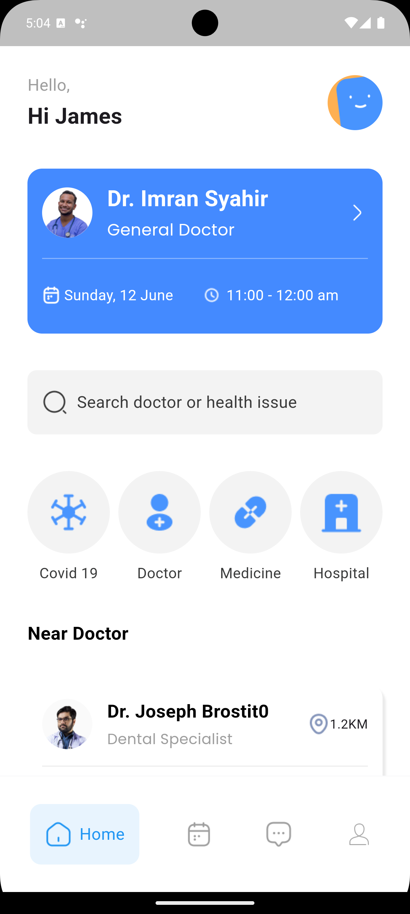
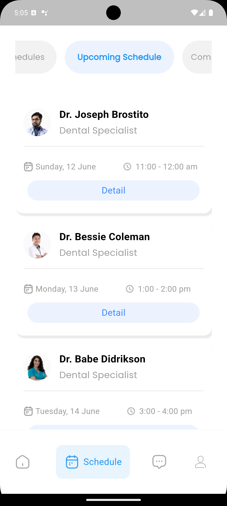

# Doctor Appointment App

## Table of Contents
- [Overview](#overview)
- [Features](#features)
- [Screenshots](#screenshots)
- [Installation](#installation)

## Overview
Doctor Appointment is a Flutter application that helps users schedule and manage their doctor appointments seamlessly. Users can view upcoming schedules, cancel appointments, and access completed schedules. 

## Features Will Include
- User authentication with Google Sign-In
- Schedule upcoming appointments
- View canceled and completed schedules
- User-friendly interface with responsive design
- Notifications for upcoming appointments

## Screenshots

*This is UI of the Home Screen*


*This is the UI of the Schedule Screen*


## Installation
To run this project, clone the repository and follow the instructions below:

```bash
git clone https://github.com/Prodigy-Genes/Dokterian-Doctor-Appointment.git
cd doctor_appointment
flutter pub get
